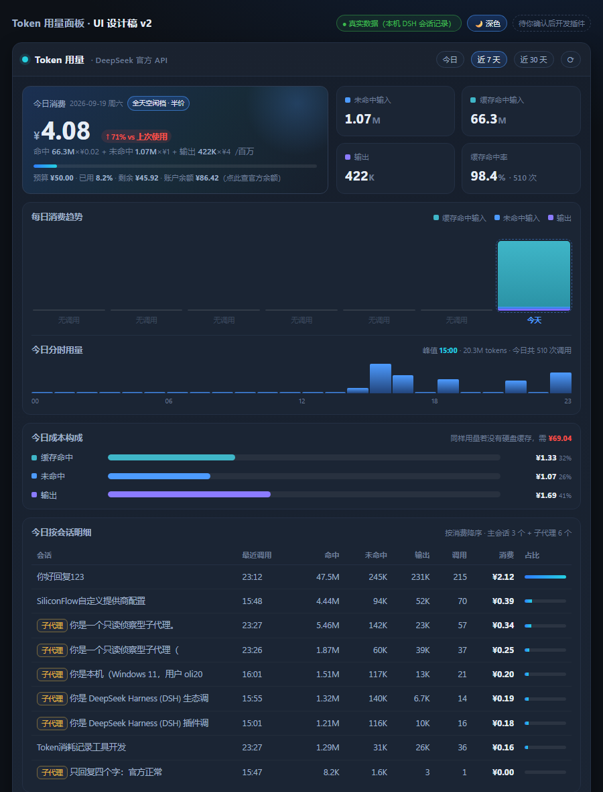

# dsh-token-meter-panel

> Token usage & cost panel for [DSH (DeepSeek Harness)](https://github.com/deepseek-ai/deepseek-harness).
> A dedicated sidebar view: how much you spent today, where it went, and how much the disk cache saved you.

[中文](README.md) | English

---

> **This is a community plugin, not an official DeepSeek plugin.** It is not affiliated with,
> endorsed by, or connected to DeepSeek in any way. The project name uses the abbreviation
> **DSH** as recommended by the official brand guidelines; "DeepSeek" and "DeepSeek Harness"
> are trademarks of DeepSeek.
>
> **The amounts shown are local estimates, not an official bill.** Built-in rates were checked
> against the [official pricing page](https://api-docs.deepseek.com/quick_start/pricing) (capture
> date below); prices can change at any time — **always defer to the official page**.

---

## The problem

DSH records per-call token usage in its session logs, but **only tokens — no money**: the kernel ships no pricing code at all.

This plugin turns usage into what you actually care about:

- **How much today** (CNY), and how much budget is left
- **Where the money went**: cached input / uncached input / output
- **How much the cache saved**: DeepSeek's cache-hit price is 1/50 of a miss
- **Which session is burning money**: per-session breakdown, subagent sessions tagged
- **When it burns**: 24-hour distribution with the peak hour marked



---

## Features

| Block | Content |
|---|---|
| Today's spend | Large amount, budget bar, delta vs previous use, account balance (optional) |
| Four metrics | Uncached input / cached input / output tokens, cache hit rate + call count |
| Daily trend | 7 / 30 days, stacked bars by the three token kinds, hover for detail |
| Today by hour | 24-hour token distribution with the peak hour marked |
| Cost breakdown | What each token kind costs, plus "what today would cost without the disk cache" |
| Per-session | Today's tokens, calls and cost per session; subagent sessions tagged |
| Live session | Real-time usage of the current conversation (from the official `tokenUsage` projection) |

Colors carry fixed meaning (teal = cached input, blue = uncached input, violet = output) and come
from DSH's own `--dsw-*` theme variables, so the panel matches the shell in both light and dark themes.

---

## Install

> **Status: not on npm yet** (npm account registration in progress). For now install from the
> GitHub Release tarball.

### Option 1 — GitHub Release tarball (available now)

1. Download `dsh-token-meter-panel-0.1.0.tgz` from
   [Releases](https://github.com/olimc2016/dsh-token-meter-panel/releases)
2. Install it:

```bash
dsh plugin --profile desktop add ./dsh-token-meter-panel-0.1.0.tgz
```

### Option 2 — npm (once published)

```bash
dsh plugin --profile desktop add dsh-token-meter-panel
```

### Option 3 — from source (developers)

```bash
git clone https://github.com/olimc2016/dsh-token-meter-panel.git
cd dsh-token-meter-panel
npm install
npm run setup     # local module-resolution links, see Development
npm test
dsh plugin --profile desktop add .
```

**Restart DSH Desktop afterwards** — plugin bundles are only resolved at host boot; the
`cordis.patch.yml` hot reload does not cover them.

A "Token" gauge icon appears at the bottom of the sidebar; click it to open the panel.

Permissions and data boundary: this plugin only reads local session logs, writes no files and runs
no commands; the only network access is the account-balance lookup, which you can switch off in
Settings for a fully zero-egress setup.
See [Privacy & permissions](#privacy--permissions).

---

## Pricing model

Costs are estimated from **DeepSeek's official pricing** — this is *not* a DSH built-in.

- Available models: `deepseek-flash`, `deepseek-v4-pro`
  (`deepseek-chat` / `deepseek-reasoner` were retired on 2026-07-24; the old `deepseek-v4-flash`
  name still routes but bills at Flash rates)
- **Off-peak price = half of peak.** Peak = Beijing time Mon–Fri 09:00–12:00 and 14:00–18:00
  (public holidays excluded; not modelled here)
- Cache-hit input costs 1/50–1/30 of a miss — the headline number this panel exists to show
- `reasoningTokens` is already inside `outputTokens`, never double-counted
- **Unknown models are never guessed**: tokens are counted, money is not.
  Better one missing number than a wrong one.
- Source: <https://api-docs.deepseek.com/quick_start/pricing> (rates captured 2026-09-19)

Rates, daily budget, alert threshold, refresh interval and the balance toggle live in
**Settings → Plugins → token-meter-panel**, and take effect immediately.

---

## Where the data comes from

Two sources, combined:

1. **Full log aggregation** — the only source of per-day history.
   Scans `$DSH_HOME/sessions/<workspace>/<session>/session[.v3].jsonl.zstd`, reads
   `data.usage` from every `assistant/message`, buckets by Beijing time.
2. **Official projection** — the "live session" card reads DSH's `useProjection('tokenUsage')`.

### Three implementation details worth knowing

DSH's `.jsonl.zstd` files are **append-only multi-frame zstd**:

- `zlib.zstdDecompressSync()` decodes only the first frame (5.3 MB in, 187 bytes out — measured)
- `zlib.createZstdDecompress()` fails after the first frame with `Unknown frame descriptor`
- The working approach is to **scan frame boundaries and decode frame by frame**
  (structurally the same as `scanZstdFrames` in `@deepseek-ai/dsh-session-persistence-jsonl`;
  see `src/zstd.mjs`)

Two aggregation traps:

- When both `session.jsonl` (v0) and `session.v3.jsonl` exist for one session, **only v3 counts**,
  otherwise usage doubles
- `data.stream[].chunk.usage` and `data.usage` are the same data — adding both doubles usage

### Known blind spots (data-source limits, not bugs)

Session-title generation and web-search calls **never record usage**, so they cannot be priced.
Active sessions are still appending, hence "today" is a lower bound (stated in the panel footer).

---

## Privacy & permissions

Short version: **this plugin is a pure observer — it only reads local logs, writes no files and
runs no commands; its only outbound traffic is the account-balance lookup, which you can switch off.**

| Permission | What this plugin actually does |
|---|---|
| **Files (read)** | Only `$DSH_HOME/sessions/**/session[.v3].jsonl[.zstd]` (DSH's own session-log directory) |
| **Files (write)** | **None** — no files, no cache on disk (aggregates live in memory and are recomputed on restart) |
| **Network** | Only the account-balance lookup; turn "show balance" off in Settings for a fully zero-egress setup |
| **Command execution** | **None** — nothing is spawned |
| **Credentials** | Resolved by **reference name** (default `DEEPSEEK_API_KEY`) from DSH's credential service; the secret stays in host-process memory and is **never sent to the browser, logged, or written to disk** |

Balance lookup:

- Calls `GET https://api.deepseek.com/user/balance` from the **host (Node) side only**; the browser never sees the key
- The panel shows `account balance ¥x` in the top-left; `off` means you disabled it in Settings, and
  `lookup failed` means the credential is missing or the endpoint returned an error
- Toggle it (and change the credential name) in **Settings → Plugins → dsh-token-meter-panel**

Local HTTP routes (used by the panel):

- `GET /token-meter-panel/summary`, `/token-meter-panel/balance`, `/token-meter-panel/health`
- **Aggregate numbers only** (token counts, money, call counts, session ids) — **never conversation
  content, file paths, or credentials**
- All three routes go through DSH's `connection` Host/Origin fence and browser authentication
  (`requestRejection`)

---

## Configuration

Settings namespace: `token-meter-panel`

| Key | Default | Meaning |
|---|---|---|
| `dailyBudget` | 50 | Daily budget in CNY; 0 = unlimited |
| `alertAtPercent` | 80 | Warn at this share of the budget (bar changes color) |
| `showBalance` | true | Query and show the account balance (off = zero network access) |
| `apiKeyEnv` | `DEEPSEEK_API_KEY` | Credential name used for the balance lookup |
| `refreshSeconds` | 60 | Panel auto-refresh interval in seconds; 0 = off |
| `officialOnly` | true | Count only DeepSeek-billed calls (third-party providers excluded) |
| `offPeak` / `peak` | official rates | Per-model unit prices (CNY per million tokens) |

---

## How it works

```
browser (panel)  ──fetch──▶  host routes              ──▶  collection core
 lib/client.js                lib/index.js                  src/core.mjs + src/zstd.mjs
 registers sidebar.panellist  GET /token-meter-panel/summary  reads ~/.dsh/sessions
 registers main keyed slot    GET /token-meter-panel/balance  multi-frame zstd decode
 useProjection(tokenUsage)    GET /token-meter-panel/health   day/session/model folds
```

The host half registers a `token-meter-panel` settings namespace; the browser half contributes two slots:
`sidebar.panellist` (icon, `id: tokenmeter`) and `main` (panel, `key: tokenmeter`) — the ids must
match so clicking the icon switches to the panel.

All three read-only routes reuse DSH's `connection.requestRejection` for the Host/Origin fence.

---

## Development

```bash
npm run setup    # create local module-resolution links (see below)
npm test         # collection self-check + host smoke + client smoke
npm run build    # rebuild lib/client.js (required after editing src/client/index.js)
npm run watch    # watch mode; works with DSH's client-hmr for live replacement
```

> **Why `npm run setup` exists**: Node resolves junctions/symlinks to their **real path**, so
> `import '@deepseek-ai/schemastery'` from inside the plugin directory never reaches the profile's
> `node_modules`. The script links the base packages into the plugin directory.
> **It is not needed at runtime**: the host's Node service resolves from the application directory
> and finds the base packages normally. Without schemastery the plugin degrades gracefully —
> no settings namespace, everything else keeps working.

Host-side changes (`lib/index.js`, `src/core.mjs`) need a DSH restart; client-side changes are picked
up by DSH's client-hmr after rebuilding the bundle.

---

## License

**MIT**, see [LICENSE](LICENSE).

The Zstandard multi-frame scanning logic in `src/zstd.mjs` is adapted from DeepSeek Harness's
`@deepseek-ai/dsh-session-persistence-jsonl` (MIT, `Copyright (c) 2026 DeepSeek`). Its copyright
and permission notice is retained as required — see [THIRD-PARTY-NOTICES.md](THIRD-PARTY-NOTICES.md).
